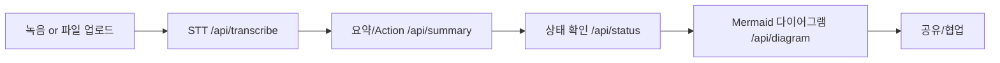

# MeetFlow AI 소개

## 1. 문제 & 비전
- 회의록 작성/정리·Action Item 관리에 많은 수작업 소요
- "회의록을 실행으로" : 회의가 끝나는 즉시 요약·Action·다이어그램까지 자동화

## 2. 주요 효과
- 전사/요약 자동화로 회의 정리 시간 절감
- Action Item 누락/책임 불명확 문제 해소
- 다이어그램/공유로 구성원 이해·협업 효율 향상

## 3. 사용 흐름

## 4. 사용법
1. 회의 ID 선택/생성 → 녹음/업로드 실행
2. "전사 요청" 버튼으로 STT 처리
3. "요약/Action 생성"으로 요약/Action Item 확인
4. "Mermaid 다이어그램 생성"으로 시각화/공유

## 5. 기술 스택
- Next.js(App Router), Tailwind, TypeScript
- Supabase(Postgres/Storage/Auth), OpenAI Whisper & GPT
- Mermaid.js 렌더링, MediaRecorder, Zod
- 문서/체크리스트: `PRD.md`, `DEV_PLAN.md`, `TASKS.md`, `PROGRESS.md`

## 6. 차별성
- 녹음→전사→요약→다이어그램까지 End-to-End 파이프라인 자동화
- 회의 히스토리/녹음 파일명을 그대로 재사용, 저장된 요약 자동 로드
- Mermaid 서브그래프/색상 기반 다이어그램으로 개요·결정·논의·Action을 한눈에 제공
- Supabase 기반으로 저장/공유/향후 알림 기능 확장 용이

## 7. 향후 계획
- 요약/Action Item 편집 UI + 키워드 검색
- 다이어그램 공유 링크/읽기 전용 뷰, 알림 채널(Slack/Email)
- 회의 템플릿/태그 관리, 검색/필터 기능
