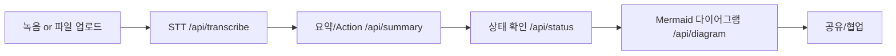

# MeetFlow AI 소개

## 1. 문제 & 비전
- 회의록 작성/정리·Action Item 관리에 많은 수작업 소요
- "회의록을 실행으로" : 회의가 끝나는 즉시 요약·Action·다이어그램까지 자동화

## 2. 주요 효과
- 전사/요약 자동화로 회의 정리 시간 절감
- Action Item 누락/책임 불명확 문제 해소
- 다이어그램/공유로 구성원 이해·협업 효율 향상

## 3. 사용 흐름

## 4. 주요 기능 시연 요약
1. **회의 생성/업로드**: Meeting ID 생성 → 브라우저 녹음 또는 파일 드롭 → `/api/upload`
2. **STT & 요약 파이프라인**: `/api/transcribe`(OpenAI Whisper) → `/api/summary`(GPT-4o mini) → Supabase 저장
3. **UI 편집 플로우**: 전사 검색·요약/Action Item 인라인 수정 → Supabase에 즉시 반영 → 다이어그램 생성
4. **공유/협업**: `/api/share`로 토큰 발급 → `/share/<token>` 읽기 전용 페이지 배포 → Slack/메일 등에 링크 전파
5. **유지보수**: `/api/admin/cleanup`으로 30일 지난 recording/diagram + Storage 객체 자동 삭제

## 5. 기술 스택
- **프론트엔드**: Next.js(App Router, Turbopack), Tailwind, TypeScript, React 19, MediaRecorder
- **백엔드**: Supabase(Postgres/Storage/Auth), OpenAI Whisper & GPT, Vercel Serverless/API Routes
- **시각/도구**: Mermaid.js, Zod, SharePanel, README/PRD/DEV_PLAN/TASKS/PROGRESS 문서

## 6. 완성된 차별 포인트
- 전사→요약→다이어그램→공유까지 단일 UI에서 끝나는 End-to-End 자동화
- 전사 텍스트 검색/편집, 요약·Action Item 인라인 편집, 회의 히스토리 자동 로드 제공
- 공유 토큰(`/share/<token>`)으로 비로그인 대상도 읽기 가능, 만료·비활성화 관리
- Cron/환경 변수 설계(README)에 따라 운영/배포/정리 프로세스를 명확히 문서화

## 7. 배포/운영 현황
- Vercel(루트: `web`)에 배포 완료, 환경 변수/cron 설정 포함
- Supabase `share_links` 테이블과 Storage 버킷 구성 완료
- README/PROGRESS에 전체 기능과 향후 유지보수 항목을 기록해 협업 준비 완료

## 8. 향후 계획
- 이메일/Slack 알림 채널 연동, 공유 링크 조회 로그/알림 고도화
- 회의 템플릿/태그, 검색·필터 기능 추가
- 다국어 모델 지원, 트랜스크립트 편집 히스토리, 정교한 권한 관리
